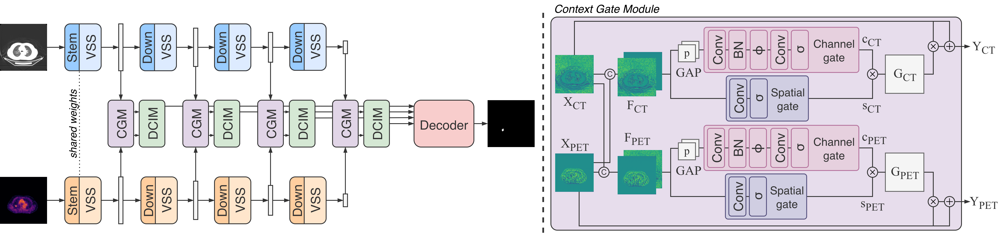

<div align="center">
<h1>Context-Gated Cross-Modal Perception with Visual Mamba for PET-CT Lung Tumor Segmentation
</h1>

[Elena Mulero Ayllón](https://scholar.google.com/citations?user=-BOMvaUAAAAJ&hl=it&oi=ao)<sup>1</sup>, 
[Linlin Shen](https://scholar.google.com/citations?user=AZ_y9HgAAAAJ&hl=en)<sup>2</sup>, 
[Pierangelo Veltri](https://scholar.google.com/citations?user=dfx_8LwAAAAJ&hl=en)<sup>3</sup>,
[Fabrizia Gelardi](https://scholar.google.com/citations?user=rVSkwbAAAAAJ&hl=it)<sup>4,5</sup>,
[Arturo Chiti](https://www.hsr.it/dottori/arturo-chiti)<sup>4,5</sup>,
[Paolo Soda](https://scholar.google.com/citations?user=E7rcYCQAAAAJ&hl=it&oi=ao)<sup>1,6</sup>, 
[Matteo Tortora](https://matteotortora.github.io)<sup>7</sup>

<sup>1</sup>  University Campus Bio-Medico of Rome,
<sup>2</sup> Shenzhen University,
<sup>3</sup> University of Calabria,
<sup>4</sup> IRCCS San Raffaele Hospital,
<sup>5</sup> Vita-Salute San Raffaele University,
<sup>6</sup>  Umeå University,
<sup>7</sup>  University of Genoa


[](https://arxiv.org/abs/2306.10356)
[](https://opensource.org/licenses/MIT)
</div>

## Overview
This repository contains the code for our paper `Context-Gated Cross-Modal Perception with Visual Mamba for PET-CT Lung Tumor Segmentation` [[Paper](https://arxiv.org/abs/2306.10356)].




## Environment Setup
1. Create a Python 3.10 environment.
   ```bash
   conda create -n vmambax python=3.10
   conda activate vmambax
   ```
2. Install PyTorch 2.1.2 (or any CUDA build matching your hardware).
   ```bash
   pip install torch==2.1.2 torchvision==0.16.2 torchaudio==2.1.2 --index-url https://download.pytorch.org/whl/cu118
   ```
3. Install project dependencies.
   ```bash
   pip install -r requirements.txt
   ```
4. Build the `selective_scan` CUDA operator.
   ```bash
   cd models/encoders/selective_scan
   pip install .
   cd ../../..
   ```

## Setup
### Dataset
In this study, we used the **PCLT20K** dataset, which comprises 21,930 PET-CT image pairs with expert-annotated lung tumors collected from 605 patients.  

Further information and data access are available from the official [PCLT20K dataset page](https://github.com/mj129/CIPA/blob/main/README.md#pclt20k) hosted by **CIPA**.


### Preparing the data
1. Place or symlink the dataset under `data/PCLT20K`.
   ```bash
   mkdir -p data
   ln -s /path/to/PCLT20K data/PCLT20K
   ```
2. Ensure `train.txt`, `test.txt`, and optionally `val.txt` are located in the dataset root.


### Required directory structure
```
PCLT20K/
├── 0001/
│   ├── 0001_CT.png
│   ├── 0001_PET.png
│   └── 0001_mask.png
├── 0002/
│   ├── 0002_CT.png
│   ├── 0002_PET.png
│   └── 0002_mask.png
├── ...
├── train.txt
├── val.txt        # optional, otherwise split is derived automatically
└── test.txt
```

### Pretrained weights

### Weights & Biases (WandB) Logging
To enable experiment tracking and visualization with Weights & Biases (WandB):
1. Export your API key before starting training:
```bash
export WANDB_API_KEY=<your_api_key>
```
2. Enable logging in any training run using:
```bash
--wandb --wandb_project vmambax --wandb_run_name <run-name>
```
All logs and metrics will be automatically synchronized to your WandB workspace.

##  Training
### Single-GPU example
```bash
python train.py \
  --img_dir data/PCLT20K \
  --split_train_val_test data/PCLT20K \
  --batch_size 8 \
  --epochs 50 \
  --lr 6e-5 \
```

### Single-GPU example with WandB Logging
```bash
python train.py \
  --img_dir data/PCLT20K \
  --split_train_val_test data/PCLT20K \
  --batch_size 8 \
  --epochs 50 \
  --lr 6e-5 \
  --wandb \
  --wandb_project vMambaX \
  --wandb_run_name context-gate \
```

### Multi-GPU examples
- Configure `CUDA_VISIBLE_DEVICES`, `--devices`, and `--nodes` as needed.

### Single Node
```bash
python train.py \
  --img_dir data/PCLT20K \
  --split_train_val_test data/PCLT20K \
  --devices 8 \
  --batch_size 4 \
  --epochs 50 \
  --lr 6e-5 \
```

### Multi Node
```bash
python train.py \
  --img_dir data/PCLT20K \
  --split_train_val_test data/PCLT20K \
  --devices 8 \
  --nodes 2 \
  --batch_size 4 \
  --epochs 50 \
  --lr 6e-5 \
```

## Inference and evaluation
1. Download or select a checkpoint (`.ckpt` from Lightning or `.pth` weights).
2. Run:
   ```bash
   python pred.py \
     --img_dir data/PCLT20K \
     --split_train_val_test data/PCLT20K \
     --checkpoint path/to/best.ckpt \
     --device cuda
   ```
3. Metrics reported: IoU, Dice, Accuracy, and HD95. Results are written to `results/`.


## Contact

For further information or inquiries, please contact **e.muleroayllon [at] unicampus [dot] it** and/or **matteo.tortora [at] unige [dot] it**.


## BibTeX & Citation

If you find this code useful, please consider citing our work:

```bibtex
@inproceedings{ayllon2025can,
  title={Can Foundation Models Really Segment Tumors? A Benchmarking Odyssey in Lung CT Imaging},
  author={Ayllón, Elena Mulero and Mantegna, Massimiliano and Shen, Linlin and Soda, Paolo and Guarrasi, Valerio and Tortora, Matteo},
  booktitle={2025 IEEE 38th International Symposium on Computer-Based Medical Systems (CBMS)},
  pages={375--380},
  year={2025},
  organization={IEEE}
}
```

## Acknowledgements
This work builds on the original [CIPA](https://github.com/mj129/CIPA) repository.  
We also acknowledge the valuable open-source contributions of [VMamba](https://github.com/MzeroMiko/VMamba) and [Sigma](https://github.com/zifuwan/Sigma).

